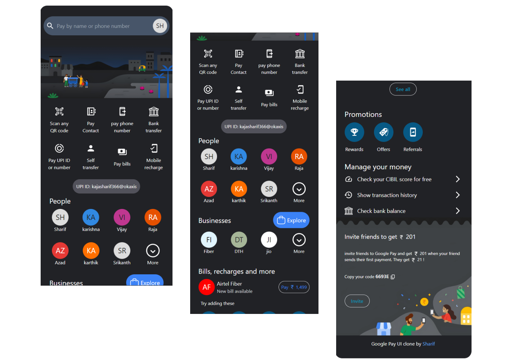

# Google Pay UI

## Table of Contents

- [Project Title](#project-title)
- [Description](#description)
- [Demo](#demo)
- [Internship](#internship)
- [Technologies Used](#technologies-used)
- [Installation](#installation)
- [License](#license)
- [acknowledgement](#acknowledgement)

## Description

Google Pay UI clone build with Tailwind css and html

## Demo

[Live Preview](https://sharif-22.github.io/Google-Pay-Ul/)

preview ui



## Internship

This internship is provided by [CyberDude Networks Pvt. Ltd.](https://youtube.com/cyberdudenetworks) as part of the 6-Month Free Internship program, a skill development initiative organized to enhance participants' skills. Mentoring was provided by [Mr. Anbuselvan Rocky](https://instagram.com/anbuselvanrocky). For more information, [you can contact CyberDude Networks here](https://cyberdudenetworks.com).

## Technologies Used

<ol>
    <li>HTML</li>
    <li>Tailwind Css</li>
</ol>

## Installation

Clone the Repository:

```
git clone https://github.com/sharif-22/Instagram-UI-Tailwind
```

Navigate to the project

```
cd Instagram-UI-Tailwind
```

Install the Dependencies

```
npm install
```

Run the Project

```
npm run dev
```

## License

[MIT](./LICENCE.md)

## acknowledgement

Thanks Vasanth for providing the banner images

<div style="
    width: fit-content;
    display: flex;
    flex-direction: column;
    align-items: center;
    justify-items: center;
  ">
</img>
<p>
<a href="https://github.com/Vk2401" target="_blank">
Vasanth
</a>
</p>
</div>
